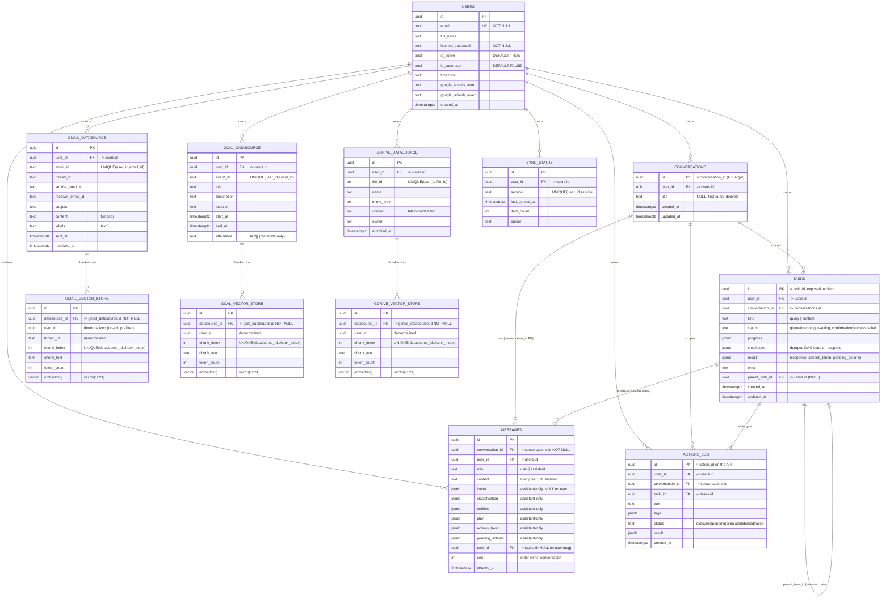

# DESIGN.md — Scaling & System Design

How the Agentic Google Workspace Orchestrator is designed to serve **1M users**,
where the load actually lands, and the concrete strategies (caching, sharding,
async offload, rate limiting) that keep it within budget — including **Gemini
free-tier limits as a first-class scaling constraint**.

---

## 1 · Target topology (1M users)

```
                         ┌────────────────────────────────────────┐
                         │            Load Balancer (L7)           │
                         │      TLS · nearest-region routing       │
                         └───────────────────┬────────────────────┘
                                             │
              ┌──────────────────────────────┼──────────────────────────────┐
              ▼                               ▼                              ▼
     ┌─────────────────┐            ┌─────────────────┐           ┌─────────────────┐
     │  FastAPI  × N    │   …        │  FastAPI  × N    │   …       │  FastAPI  × N    │   (stateless)
     │  enqueue + poll  │            │  enqueue + poll  │           │  enqueue + poll  │
     └────────┬─────────┘            └────────┬─────────┘           └────────┬────────┘
              │  (request path is only: validate JWT → write tasks row → enqueue)
              ▼
     ┌────────────────────────────────────────────────────────────────────────────┐
     │  Redis (clustered)   broker · stream:tasks:* progress · caches · rate buckets │
     └───────────┬───────────────────────────────────────────────┬─────────────────┘
                 │ broker                                          │ cache/streams
                 ▼                                                 ▼
     ┌─────────────────────┐                          ┌──────────────────────────────┐
     │  Celery workers × N   │  orchestrate / confirm  │  Postgres + pgvector          │
     │  classify→plan→exec   │────── read/write ──────▶│  sharded/partitioned by user  │
     │  →synth · 15-min beat │                          │  HNSW vector_cosine_ops       │
     └──────────┬────────────┘                          └──────────────────────────────┘
                │ external (OpenAI-compat REST, httpx)
                ▼
     ┌─────────────────────────────────────────┐
     │  Google Gemini (AI Studio, free tier)     │  chat/completions + embeddings
     └─────────────────────────────────────────┘
```

**The load-bearing decision: the request path does almost nothing.** `POST /query`
validates the JWT, inserts a `tasks` row, and enqueues a Celery task — then returns
`202` with a `task_id`. **All** classification, planning, retrieval, and synthesis
happen inside the worker. So HTTP latency is decoupled from pipeline length: the
API stays sub-100 ms P99 no matter how many LLM stages a query needs, and API tiers
scale **horizontally and statelessly** (JWT is self-contained — no session store).

The three tiers scale independently:

| Tier | Scale signal | Nature |
|---|---|---|
| **FastAPI × N** | request QPS | I/O-bound, stateless, trivially horizontal |
| **Celery workers × N** | queue depth / task P99 | the heavy tenant; scale on backlog |
| **Postgres + pgvector** | corpus size, search QPS | shard/partition by `user_id` (below) |
| **Redis** | cache RSS, stream volume | cluster; split broker from cache (below) |

Inference stays **external** (Gemini), so the app image is **CPU-only** — no model
weights, no GPU tier to run. Scaling inference = raising the Gemini quota tier, not
provisioning hardware.

---

## 2 · Caching strategy (target: >80% hit rate)

Three hot, recomputable artifacts live in Redis. **Every key is user-scoped** to
prevent cross-user cache poisoning; auth is stateless JWT so no session data sits in
Redis.

| Cache | Key | TTL | Skips |
|---|---|---|---|
| **Query embedding** | `user:{user_id}:emb:{sha256(text)}\|model` | 1 h | a Gemini `embeddings` round-trip on the hot query path |
| **Intent classification** | `user:{user_id}:intent:{sha256(query+ctx_hash)}` | 1 h | LLM call #1 (the classifier) for a repeated ask |
| **Conversation context** | `user:{user_id}:conv:{conversation_id}` | rolling last-5 | a Postgres read of the last N `messages` |

Corpus embeddings are **not** cached in Redis — they are persisted in pgvector and
recomputed only when the 15-min beat re-chunks a changed item.

**Why caching is load-bearing here (not just latency):** under `EMBED_MODE=real`
every cache miss spends **Gemini free-tier quota**. The embedding + intent caches
are therefore the primary quota-conservation mechanism — see §4. At >80% hit rate,
4 in 5 repeated/similar asks by a user cost **zero** external calls.

---

## 3 · Async processing & pre-computation

- **All orchestration runs in Celery.** A query is a 2–5 s, three-LLM-stage
  pipeline; running it in-request would pin an HTTP worker for seconds. Offloading
  to Celery keeps the API thread pool free and the request path at enqueue-only
  latency. Two observers watch one execution: `GET /tasks/{id}` **polls** the DB
  row; `WS /ws/query` **subscribes** to the `stream:tasks:{task_id}` Redis stream.
- **One 15-min sync beat** (`SYNC_BEAT_MINUTES`) fetches new/changed items and
  **chunks + embeds them inline in the same pass**, writing `*_vector_store` rows —
  so an item is searchable the moment the beat commits it (embedding freshness
  < 15 min). A single beat is a **hard singleton** (§6): two beats double-fire the
  sync and burn quota.
- **Write gate = durable suspension, not re-run.** A mutating tool checkpoints the
  DAG to `tasks.checkpoint`, sets `status=awaiting_confirmation`, and exits the
  worker cleanly. Confirm/deny spawns a *new* task that resumes from the checkpoint
  (`parent_task_id` chains them) — no worker slot is held while waiting on a human.

---

## 4 · Rate limiting & the Gemini free-tier constraint

**Two independent limits apply, and the second is the real scaling ceiling.**

### 4a · Per-user application limit
A Redis fixed-window token bucket enforces **100 queries/user/hour**
(`ratelimit:{user_id}:{YYYYMMDDHH}`, 1 h expiry → `429` on overflow). This protects
the shared backend from a single tenant and is the app's own fairness knob.

### 4b · Gemini free-tier RPM/RPD — a global, provider-imposed ceiling
Unlike the per-user limit, Gemini's **requests-per-minute / requests-per-day** caps
are **shared across the whole deployment** and cannot be raised by adding workers —
adding workers only hits the wall faster. This is the dominant constraint on the
free tier. Mitigations, in order of impact:

1. **Caching (§2) is the first line of defense.** The query-embedding and intent
   caches turn repeated work into zero-cost hits; at >80% hit rate the *effective*
   external RPM is cut ~5×.
2. **Embedding batching.** The embedder batches up to `GEMINI_EMBED_BATCH_SIZE`
   (32) texts per `embeddings` call, so the 15-min corpus re-embed and multi-chunk
   queries collapse into far fewer requests.
3. **Concurrency cap + backoff.** Outbound Gemini concurrency is capped at
   `GEMINI_MAX_CONCURRENCY` (4); `429`/`503` are retried with exponential backoff +
   jitter honoring `Retry-After`, bounded by `GEMINI_MAX_RETRIES` (5) — so a
   momentary quota spike degrades to slight latency, not errors.
4. **Beat pacing.** The sync beat re-embeds in paced batches so a full-corpus pass
   stays within the daily (RPD) budget.

> Beyond the free tier the same design scales by **raising the Gemini quota tier**
> (a config change) — the architecture, batching, and caches are unchanged. The
> real Google Workspace APIs (Phase 2) add a second provider ceiling (250 units/s),
> mitigated by the identical batching + backoff posture.

---

## 5 · Sharding, partitioning & multi-region

- **Partition by `user_id`.** Every query is scoped `WHERE user_id = …`, and the
  `*_vector_store` tables carry a **denormalized `user_id`** so the user prefilter
  is a no-join btree lookup *before* the vector scan. This makes `user_id` the
  natural shard key: Postgres **declarative range/hash partitioning** on `user_id`
  keeps each partition's HNSW index small (faster, cheaper to rebuild), and
  **[Citus](https://www.citusdata.com/)** is the drop-in horizontal option to shard
  across nodes with no query rewrite. Tenant isolation and shard locality come from
  the same key.
- **Metadata prefilter before vectors.** Structured filters (sender, date range,
  attendee, mime, labels) run as btree lookups on the `*_datasource` side, shrinking
  the candidate set the cosine scan must rank — "metadata filtering > pure vector
  search for speed."
- **Multi-region (US / EU / APAC).** Deploy the full stack per region and route
  each user to their nearest region at the LB. Because `user_id` is the shard key,
  a user's data has a single home region — no cross-region fan-out on the hot path;
  data-residency (EU) falls out for free.

---

## 6 · Bottlenecks on a single co-resident VM (ranked by how fast they bite)

The take-home runs API + worker + beat + Postgres + Redis on **one VM** with `C`
vCPUs sharing one CPU/RAM budget. Ranked by which breaks first:

1. **CPU contention: Postgres/pgvector HNSW vs. Argon2 hashing** — both CPU-bound,
   both on-box. The `<500 ms` search target slips first. *Mitigate:* cap worker
   concurrency, `cpuset`/CPU-limit Postgres vs. app, honor the embedding cache to
   skip embed CPU.
2. **A single blocking call stalls the async event loop** — Argon2 **must** run in
   `anyio.to_thread`; any stray sync DB driver / sync `httpx` / CPU loop on the loop
   serializes everything behind it. On one VM there is no second box to absorb the
   stall. Latent until concurrency rises.
3. **Postgres connection-pool exhaustion** — `2 uvicorn × pool + K worker × pool +
   beat` against one `max_connections=100`. Symptom: `TimeoutError` on acquire under
   burst. *Mitigate:* small per-process pools (`pool_size=5, max_overflow=5`) or a
   **PgBouncer** sidecar (transaction pooling).
4. **Memory pressure → OOM-kill** — HNSW + in-flight embeddings + interpreters
   ×(uvicorn + celery children). The OOM killer targets the biggest RSS, usually a
   worker child mid-task (looks like a random task failure). *Mitigate:* explicit
   `mem_limit` per service, low concurrency, batch embeddings (~32).
5. **Single VM = shared SPOF, no failover** — API + worker + beat die together on
   saturation/restart; a crashed beat silently stops sync (freshness SLO) until
   restart. *Cushion:* `unless-stopped` + healthchecks.
6. **Redis doing four jobs** (broker + progress streams + cache + rate buckets) —
   broker safety wants `noeviction` while the cache wants `allkeys-lru`: genuinely
   in tension in one instance. *Mitigate:* split broker-Redis from cache-Redis (even
   on one VM); trim `stream:tasks:*`.
7. **External inference latency dominates task wall-time** — three LLM stages over
   the network **hold a worker slot the whole time**, so slow inference indirectly
   starves worker concurrency (I/O wait, not CPU). *Mitigate:* intent + embedding
   caches, timeouts + retry, raise concurrency only if RAM allows.

**Verdict.** Fine for the take-home / low traffic. The structural ceiling is
co-residency: CPU-bound Postgres/pgvector + Argon2 share cores with an I/O-bound
worker whose slots are held hostage by external LLM latency, all under one RAM
budget. First to break is search latency (#1); scariest are a silent event-loop
stall (#2) or an OOM-killed task (#4). **The clean escape is the same CPU-only
image on separate VMs with Postgres/Redis moved off-box** — exactly the §1 topology,
no second Dockerfile.

---

## 7 · Metrics & SLOs

| Metric | Target | Why it matters |
|---|---|---|
| `POST /query` HTTP P99 | **< 100 ms** | request path only enqueues + reads a row — must stay flat regardless of pipeline length |
| Task-internal P99 (classify+plan+execute+synth) | **< 2 s** | end-to-end perceived latency of a full orchestration |
| Hybrid search latency | **< 500 ms** | retrieval quality target; the first thing co-residency erodes (bottleneck #1) |
| Retrieval **Precision@5** | **> 0.8** | embedding/search quality gate (hard gate under live Gemini) |
| Cache hit rate | **> 80%** | both a latency and a **quota** SLO (§4) — misses spend Gemini free-tier budget |
| API error rate | **< 0.1%** | overall reliability |
| Embedding freshness (sync lag) | **< 15 min** | the beat cadence; a stalled beat is the silent SLO breach (bottleneck #5) |

Observability hooks: task state transitions are written to the `tasks` row and
mirrored to `stream:tasks:*` (per-task progress); `actions_log` is the durable audit
trail for every write; `sync_status` exposes per-service `last_synced_at` +
`item_count` for freshness monitoring.

---

## 8 · Data model (ER diagram)

Everything is owned by a `user` (multi-tenant isolation via `user_id` on every
table). Each service has a **canonical `*_datasource`** record (full content, no
vectors — the source-of-truth synth reads from) and a **`*_vector_store`** child
holding one embedded **chunk** per row (denormalized `user_id` for the no-join
prefilter). Vectors are `vector(1024)`; history is `conversations` + `messages`
(one row per turn-message).



### Indexes (per `backend/migrations/versions/0001_initial.py`)

- **HNSW `vector_cosine_ops`** on each `*_vector_store.embedding` — the ANN index
  for cosine search (`CONCURRENTLY` in prod).
- **btree `*_vector_store(user_id)`** — the no-join user prefilter; **btree
  `*_vector_store(datasource_id)`** — the parent-collapse join.
- **btree on the `*_datasource` metadata** — `(user_id, received_at/start_at/
  modified_at)` and `sender_email_id`/`attendees` for the structured prefilter.
- **btree `tasks(user_id, status, created_at)`** and **`tasks(parent_task_id)`** —
  polling + resume-chain traversal.
- **btree `messages(conversation_id, seq)`** — ordered last-N-turn context reads.

---

## 9 · Embedding quality

- **What to embed.** Gmail: `subject + "\n" + cleaned_body` (quoted reply history +
  signature stripped). GCal: `title + description + location` as one atomic chunk
  (attendees are metadata-only, not embedded). GDrive: recursive **structural**
  split (headings → paragraphs → sentences), 512-token target / 64 overlap, so a hit
  resolves to the relevant section of a large doc.
- **Hybrid ranking.** SQL metadata prefilter → `ORDER BY embedding <=> :q` (cosine)
  → **collapse to parent** (`DISTINCT ON (datasource_id)`, best chunk per item so one
  doc can't flood the top-N) → optional rerank → **recency decay** `score·exp(-λ·age)`.
- **Cosine is magnitude-invariant**, so Gemini's MRL-truncated 1024-dim vectors need
  no renormalization, and query/corpus are embedded **symmetrically** (no BGE prefix).
- **Reranker** (`bge-reranker`) is built but **disabled by default** — enabled only
  if golden-set Precision@5 dips below 0.8.
