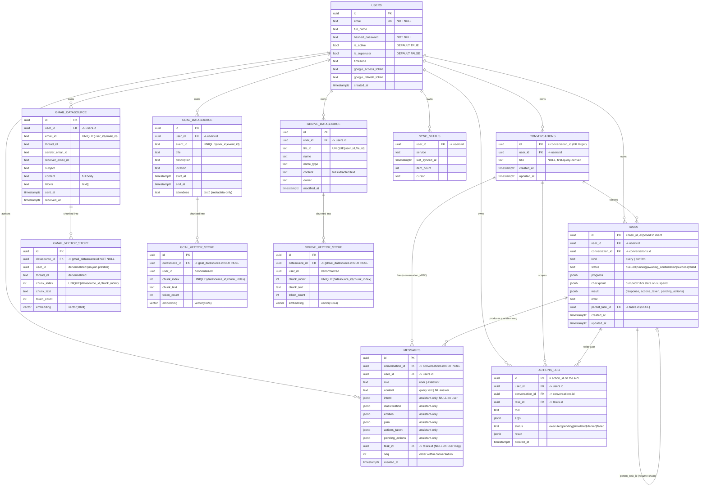

# Plan: Agentic Google Workspace Orchestrator

## Context

This is a greenfield take-home (`/home/planck/dev/alphalaw/google-assistant`, only the assignment file
present). Goal: an orchestrator that takes a natural-language query, classifies intent, plans an execution
DAG, fans out to Gmail/GCal/Drive agents in parallel, does semantic + hybrid search over pgvector, and
synthesizes a natural-language answer. Rubric weights **orchestration logic, embedding quality, and scaling
design** — not Google API plumbing. Restrictions: **no LangChain/LlamaIndex/agent frameworks, no managed
vector DBs** — everything from scratch on FastAPI + Postgres/pgvector + Redis + Celery. Time budget 6–8h.

**Deviation from the sample stack:** inference + embeddings are **Google Gemini (AI Studio) via its
OpenAI-compatibility layer** — one async httpx client points at `INFERENCE_BASE_URL`
(`https://generativelanguage.googleapis.com/v1beta/openai/`) for both `chat/completions` and `embeddings`,
authed by `Authorization: Bearer ${GEMINI_STUDIO_API_KEY}`, operated under **free-tier** limits (throttle +
`429` backoff; the query-embedding cache is load-bearing for quota). Chat = `gemini-2.5-flash`
(env-overridable); embeddings = `gemini-embedding-001` at **1024 dims** via the OpenAI-compat `dimensions`
param (MRL truncation; cosine is magnitude-invariant so no renormalization), so the schema stays
`vector(1024)`, not the sample's 1536. No `google-*` SDK — plain httpx over the OpenAI-compat REST keeps
the image CPU-only. (The `.omo/plans/backend-orchestrator.md` work plan holds the authoritative Gemini
OVERRIDE detail.)

### Locked decisions

| Decision | Choice | Consequence |
|---|---|---|
| Data layer | Mock seeded corpus behind a `Provider` interface | Real Google swappable later; no OAuth in the critical path |
| Request model | `POST /query` enqueues a Celery task, returns `task_id`; client polls `GET /tasks/{id}` | Whole pipeline is async; `tasks` table is the lifecycle SoR |
| Pipeline stages | `query → Classifier → Intent JSON → Planner → DAG JSON → Executor → Synthesizer → response` | Two distinct LLM stages before execution (classify + plan) |
| Structured output | Prompt + JSON mode, parse→validate→repair→retry (Pydantic v2) | No reliance on constrained decoding / tool-calling |
| Progress transport | Task publishes progress to Redis; WS subscribes to the stream; poll reads the DB `tasks` row | One execution path (the task), two observers (WS + poll) |
| Write gate | Parent task **checkpoints the DAG** and suspends (`status=awaiting_confirmation`); confirm/deny spawns a **resume task** that continues from the checkpoint | Durable continuation — not a re-plan/re-run |
| Pre-computation | **One 15-min Celery beat**: background sync that fetches new emails/events/files **and indexes/embeds them inline** in the same pass | Single beat, no separate embed cron; rows are searchable as soon as sync writes them |
| Caching | Redis caches (a) input **query embeddings** (1h TTL), (b) **intent classifications**, (c) **conversation context** | The three hot, recomputable artifacts; corpus embeddings live in pgvector, not Redis |
| Embeddings | **Gemini `gemini-embedding-001` @ 1024** (OpenAI-compat `dimensions=1024`, MRL) | `vector(1024)`; BGE prefix N/A → symmetric query/corpus embedding; cosine (magnitude-invariant) |
| Reranking | Hybrid first; add `bge-reranker-v2-m3` only if golden-set Precision@5 < 0.8 | Keeps latency low by default; **disabled with Gemini (no rerank endpoint) unless a separate reranker service is added** |
| Inference infra | **Gemini AI Studio (free tier)** via env (`GEMINI_STUDIO_API_KEY`, `INFERENCE_BASE_URL`, `CHAT_MODEL`, `EMBED_MODEL`) | External; app docker-compose stays CPU-only; free-tier throttle + `429` backoff |
| Eval harness | Calls the pipeline coroutine **in-process** (bypasses Celery + HTTP) | Precision@5 and <500ms search latency stay measurable |
| Bonuses | Conversation context, Conflict detection, WebSocket progress stream (+ Docker as required infra) | — |
| Auth | FastAPI-native JWT: PyJWT HS256 · pwdlib (Argon2 primary, bcrypt fallback) · `OAuth2PasswordBearer` → `get_current_user` → `CurrentUser` dep | Stateless; no session store; `user_id` established at HTTP boundary, passed as plain UUID argument to every Celery task; JWT tokens never stored in Redis or forwarded into task bodies |

## Architecture

```
POST /api/v1/query {query, conversation_id, confirm?}
      │  enqueue → returns { task_id, status:"queued" }               ← Redis broker
      ▼
Celery task: orchestrate(task_id)                                     ← progress → Redis · tasks row
   1. Intent Classifier   (LLM #1, JSON) → Intent{ services[], intent, entities{}, steps[] }
   2. Planner             (LLM #2, JSON) → Plan{ nodes[] w/ depends_on, parallel|sequential, args, optional }
   3. Executor            topo-sort · asyncio.gather parallel layers · deferred-arg extractor
        ├─ GmailAgent    search_emails / get_email / send_email* / draft_email / update_labels*
        ├─ GCalAgent     search_events / get_event / create_event* / update_event* / delete_event*
        └─ DriveAgent    search_files / get_file / share_file* / create_folder* / move_file*   (* = write-gated)
                         each agent → Provider (MockProvider now, GoogleProvider stub)
                         search() = hybrid pgvector (SQL prefilter → cosine → [rerank] → recency)
        ── * write gate ─▶ dump DAG checkpoint → tasks.checkpoint · status=awaiting_confirmation · STOP
   4. Synthesizer         (LLM #3) → { response, actions_taken, pending_actions }
      ▼
tasks.result = {...} · status=success · append user+assistant messages → conversations/messages · publish "done" → Redis
      │
      ├─ GET /api/v1/tasks/{task_id}   polls the row {status, progress, result | error, pending_actions?}
      └─ WS  /ws/query                 subscribes to the Redis progress stream for task_id

Confirm/resume path:
POST /query {confirm:{action_id, decision}, conversation_id}
      │  API resolves action_id → parent tasks.checkpoint · enqueues resume task
      ▼
Celery task: executor.resume(checkpoint, decision)
      → apply decision to gated node · continue remaining DAG · synth
      → new task_id (polled the same way; may itself suspend again)
      → tasks.parent_task_id links the chain
```

Cross-cutting: **Redis** — Celery broker + per-task progress streams `stream:tasks:{task_id}` +
rate-limit token buckets, and **caching** of (a) input query embeddings (1h TTL), (b) intent
classifications, (c) rolling conversation context · **Celery** with **one 15-min beat** (background
sync that also indexes/embeds new items) plus the on-demand **orchestrate** / **confirm** tasks. Auth middleware (`get_current_user`) runs at the FastAPI HTTP boundary on every protected route — `user_id` extracted from the JWT `sub` claim and passed explicitly into every downstream Celery task argument; JWT tokens are never stored in Redis and never forwarded into task bodies.

## Repo layout

```
backend/
  main.py                FastAPI app + router/ws wiring
  config.py              pydantic-settings (DB, Redis, GEMINI_STUDIO_API_KEY, INFERENCE_BASE_URL
                         [Gemini OpenAI-compat base], CHAT_MODEL, EMBED_MODEL, RERANK_MODEL, EMBED_DIM=1024,
                         EMBED_MODE=fake|real, EMBED_QUERY_PREFIX, GEMINI_MAX_CONCURRENCY / EMBED_BATCH_SIZE /
                         MAX_RETRIES, DEFAULT_TZ, rate limits, SYNC_BEAT_MINUTES=15,
                         SECRET_KEY [**no default — raises `ValueError` at startup if unset**; generate:
                         `python -c "import secrets; print(secrets.token_urlsafe(32))"`],
                         ALGORITHM="HS256", ACCESS_TOKEN_EXPIRE_MINUTES=60*24*8 [8 days],
                         FIRST_SUPERUSER_EMAIL, FIRST_SUPERUSER_PASSWORD)
  core/ security.py   create_access_token(subject, expires_delta) → JWT str (PyJWT HS256)
                      verify_password(plain, hashed) → (bool, updated_hash|None) via pwdlib
                      get_password_hash(password) → Argon2 hash via pwdlib
                      ALGORITHM = "HS256"
                      DUMMY_HASH: constant Argon2 hash for timing-attack guard in authenticate()
        crud.py       create_user(session, user_create) → User (hashes password inline)
                      get_user_by_email(session, email) → User | None
                      authenticate(session, email, password) → User | None
                        (calls verify_password(candidate, stored_hash or DUMMY_HASH)
                         to prevent timing attacks; auto-saves updated hash when pwdlib
                         returns a re-hashed value — bcrypt→Argon2 upgrade path)
  db/  models.py  session.py                SQLModel (table=True) on async SQLAlchemy 2.x + asyncpg
  migrations/            Alembic (target_metadata = SQLModel.metadata; pgvector ext; vector(1024)
                         + HNSW vector_cosine_ops indexes)
  llm/ client.py         OpenAI-compatible async client (httpx); chat() + embed()
       json_utils.py     extract-JSON + Pydantic validate + one repair reprompt + retry
       prompts/          classifier, planner, extractor, synthesizer, clarify templates
  orchestration/
       executor.py       topo + asyncio.gather; deferred args; progress → Redis; suspend on write gate
       models/
            intent.py    Intent schema (services, intent, entities, steps, needs_clarification)
            dag.py       Plan / Node schemas (typed DAG)
       stages/
            classifier.py   Stage 1 — LLM call → Intent
            planner.py      Stage 2 — Intent → Plan (LLM call, JSON mode)
            tests/
                 conftest.py     stub_llm (replays fixtures/) — extends root tests/conftest.py
                 fixtures/llm/classifier/*.json   recorded Intent completions per query (Tier 1)
                 fixtures/llm/planner/*.json      recorded Plan completions per Intent (Tier 1)
                 test_classifier.py   query → Intent contract (single / multi / hard, parametrized)
                 test_planner.py      Intent → Plan DAG contract (shape, deps, deferred refs, registry guard)
       agents/           base.py (Provider iface + BaseAgent)  gmail.py  gcal.py  drive.py
       utils/
            checkpoint.py   DAG state (de)serialization for suspend/resume
            tools.py        tool registry (e.g. "gmail.search_emails" → coro)
  embeddings/ embedder.py (BGE prefix + Redis cache + batch)  reranker.py  search.py (hybrid)
  providers/ mock/ seed.py (corpus) + mock_provider.py     google/ provider.py (stub)
  synth/ synthesizer.py
  context/ conversation.py       features/ conflict.py
  workers/
       celery_app.py     app + beat schedule
       sync.py           15-min beat: fetch new/changed emails/events/files → upsert *_datasource → chunk + embed → *_vector_store
       orchestrate.py    the /query pipeline as a Celery task (classify → plan → execute → synth)
                         · progress → Redis · checkpoint on write gate · result → tasks.result
       confirm.py        resume-from-checkpoint Celery task (executor.resume)
  api/
       routes_query.py   POST /query → enqueue orchestrate | confirm → task_id
       routes_tasks.py   GET /tasks/{id} — poll status / progress / result
       routes_login.py   POST /login/access-token (OAuth2PasswordRequestForm → Token)
                         POST /login/test-token   (CurrentUser → UserPublic)
       routes_users.py   POST /users/ (superuser-gated, is_superuser check)
                         GET  /users/me (CurrentUser)
                         POST /users/signup (open, no is_superuser/is_active in body)
       routes_auth.py    GET /auth/google → HTTPException(501) Phase-2 stub only
                         (no google-auth import, no OAuth state machine in Phase 1)
       routes_sync.py    POST /sync/trigger, GET /sync/status
       ws.py             /ws/query — subscribes to Redis progress stream for a task_id
       deps.py           rate limit (100/user/hr); auth deps: reusable_oauth2
                         (OAuth2PasswordBearer tokenUrl="/api/v1/login/access-token"),
                         get_current_user (decode JWT → TokenPayload.sub → session.get(User)),
                         CurrentUser = Annotated[User, Depends(get_current_user)],
                         get_current_active_superuser (403 if not is_superuser)
  eval/ golden_set.json  evaluate.py   (imports pipeline() in-process; Precision@5 + latency)
scripts/ seed.py  export_openapi.py
Dockerfile   .dockerignore   docker-compose.yml   README.md  DESIGN.md  API.md  openapi.json  tests/
```

## Data model & migrations

**ORM: SQLModel** (Pydantic + SQLAlchemy in one). Tables are `table=True` classes in `db/models.py`; a
`*Base` per entity is reused for API request/response schemas (SQLModel's `HeroBase → Create/Public` pattern),
so there's no separate Pydantic DTO layer. **Async** via `create_async_engine` + `AsyncSession`
(`sqlmodel.ext.asyncio.session`, so `session.exec()` still works); FastAPI `get_session()` dependency yields
the async session. Relationships declare `sa_relationship_kwargs={"lazy": "selectin"}` to stay async-safe.
**pgvector column**: `embedding: list[float] = Field(sa_column=Column(Vector(1024)))`, filled inline by
the 15-min sync beat as each item is ingested. Hybrid search stays Core/`text()` on the same
`AsyncSession` — cosine (`embedding <=> :q` / `Vector.cosine_distance()`) is unchanged. Alembic sets
`target_metadata = SQLModel.metadata`; a bootstrap path can `conn.run_sync(SQLModel.metadata.create_all)`
for quick starts. Extend the assignment schema; embeddings become `vector(1024)`.

- **users**(id UUID PK, email UNIQUE NOT NULL, full_name TEXT,
  hashed_password TEXT NOT NULL, is_active BOOL DEFAULT TRUE,
  is_superuser BOOL DEFAULT FALSE, timezone TEXT,
  google_access_token TEXT, google_refresh_token TEXT, created_at)
  SQLModel classes: `UserBase`(email, full_name, is_active, is_superuser, timezone) →
  `UserCreate(UserBase)` (+ password; admin path) ·
  `UserRegister` (email, password, full_name only — **MUST NOT** include `is_superuser`/`is_active`
  fields to prevent privilege escalation) · `UserPublic(UserBase)` (+ id, created_at) ·
  `User(UserBase, table=True)` (+ id, hashed_password, google tokens, relationships).
  Owned-resource FK pattern: `owner_id: uuid.UUID = Field(foreign_key="user.id", nullable=False, ondelete="CASCADE")` + `Relationship(back_populates=...)`.
  Auth models: `Token(access_token: str, token_type: str = "bearer")` ·
  `TokenPayload(sub: str | None = None)` (sub = user UUID as string).
  First-superuser seeded by `scripts/seed.py` — reads `FIRST_SUPERUSER_EMAIL` /
  `FIRST_SUPERUSER_PASSWORD` from env; idempotent (no-op if user already exists).
- **conversations**(id UUID PK (= `conversation_id`, the FK target for every `conversation_id` column
  below), user_id→users, title TEXT NULL (first-query-derived), created_at, updated_at) — the **thread**
  entity; one row per conversation, **one conversation has many `messages`**. Replaces the old flat
  per-turn mirror.
- **messages**(id UUID PK, conversation_id→conversations **NOT NULL** (the linking FK; ON DELETE CASCADE),
  user_id→users, role[user|assistant], content TEXT, task_id→tasks NULL, seq INT, created_at) — one row
  **per turn-message**; a completed turn writes **two** rows (the user query + the assistant response).
  **Assistant-only** columns (NULL on `role=user` rows): intent JSONB, classification JSONB, entities JSONB,
  plan JSONB, actions_taken JSONB, pending_actions JSONB. `content` = the user's query text on user rows,
  the synthesized NL answer on assistant rows. `task_id` links an assistant message to the task that
  produced it (NULL on user messages). Powers "last 5 turns" context (read the last N `messages` for a
  `conversation_id`, ordered by `seq`).
  SQLModel classes: `MessageBase`(role, content) → `Message(MessageBase, table=True)` (+ id,
  conversation_id/user_id/task_id FKs, seq, the assistant-only JSONB columns, `created_at`,
  relationships) · `MessagePublic(MessageBase)` (+ id, conversation_id, task_id, seq, created_at, and the
  assistant-only fields). `ConversationBase`(title) → `Conversation(ConversationBase, table=True)`
  (+ id, user_id FK, timestamps, `messages: list["Message"] = Relationship(back_populates="conversation",
  sa_relationship_kwargs={"lazy": "selectin"})`) · `ConversationPublic` (+ id, created_at) ·
  `ConversationWithMessages(ConversationPublic)` (+ messages: list[MessagePublic]).
- **tasks**(id UUID PK (= task_id, exposed to client), user_id→users, conversation_id→conversations,
  kind[query|confirm], status[queued|running|awaiting_confirmation|success|failed],
  progress JSONB, checkpoint JSONB, result JSONB, error TEXT,
  parent_task_id→tasks NULL, created_at, updated_at) — **lifecycle SoR** for the Celery task.
  `checkpoint` holds the dumped DAG state on write-gate suspend; `result` holds the final
  `{response, actions_taken, pending_actions}`; `parent_task_id` links a resume task to the suspended
  parent.
- **gmail_datasource**(id, user_id→users, email_id, thread_id, sender_email_id, receiver_email_id,
  subject, content TEXT, labels[], sent_at, received_at, UNIQUE(user_id,email_id)) — **canonical email
  record** (full content + metadata, **no vectors**); the source of truth synth reads from.
- **gmail_vector_store**(id, datasource_id→gmail_datasource **NOT NULL** (ON DELETE CASCADE), user_id
  (**denormalized** for no-join user prefilter), thread_id (denormalized for thread reconstruction),
  chunk_index, chunk_text TEXT, token_count, embedding vector(1024), UNIQUE(datasource_id,chunk_index)) —
  **one row per chunk**, N:1 back to `gmail_datasource`. Chunking: strip quoted reply history + signature,
  embed `subject + "\n" + cleaned_body`; short email → 1 chunk, long body → 512-token windows / 64 overlap.
- **gcal_datasource**(id, user_id→users, event_id, title, description TEXT, location, start_at, end_at,
  attendees[], UNIQUE(user_id,event_id)) — canonical event record; **attendees are metadata-only**
  (structured filter, not embedded).
- **gcal_vector_store**(id, datasource_id→gcal_datasource **NOT NULL** (ON DELETE CASCADE), user_id
  (denormalized), chunk_index, chunk_text TEXT, token_count, embedding vector(1024),
  UNIQUE(datasource_id,chunk_index)) — one row per chunk. Chunking: **1 chunk = whole event**
  (`title + description + location`); split only if `description` exceeds the token window.
- **gdrive_datasource**(id, user_id→users, file_id, name, mime_type, content TEXT (full extracted text),
  owner, modified_at, UNIQUE(user_id,file_id)) — canonical file record.
- **gdrive_vector_store**(id, datasource_id→gdrive_datasource **NOT NULL** (ON DELETE CASCADE), user_id
  (denormalized), chunk_index, chunk_text TEXT, token_count, embedding vector(1024),
  UNIQUE(datasource_id,chunk_index)) — one row per chunk, **many chunks per file**. Chunking: **recursive
  structural split** on natural boundaries (headings → paragraphs → sentences), 512-token target /
  64-token overlap, so a hit resolves to the relevant section of a large doc (synth widens via
  `datasource_id + chunk_index±1`).

  SQLModel classes (each service follows the same two-class split): `Gmail Datasource(table=True)` holds the
  canonical columns + `chunks: list["GmailChunk"] = Relationship(back_populates="datasource",
  sa_relationship_kwargs={"lazy": "selectin"})`; `GmailChunk(table=True)` = the `gmail_vector_store` row with
  `datasource_id`/`user_id`/`thread_id`, `chunk_index`, `chunk_text`, `token_count`, and the
  `embedding: list[float] = Field(sa_column=Column(Vector(1024)))` column. `*Public` variants expose the
  datasource metadata (never the raw `embedding`). GCal/GDrive mirror this exactly
  (`GCalDatasource`/`GCalChunk`, `GDriveDatasource`/`GDriveChunk`).
- **actions_log**(id, user_id, conversation_id→conversations, task_id→tasks, tool, args JSONB,
  status[executed|pending|simulated|denied|failed], result JSONB, created_at) — audit + the
  write-confirmation gate; a follow-up confirm resolves an `actions_log.id` (= `action_id` on the API)
  back to its parent task's checkpoint.
- **sync_status**(user_id, service, last_synced_at, item_count, cursor TEXT).

Indexes: HNSW `vector_cosine_ops` per `*_vector_store.embedding` (fallback IVFFlat, matching the sample);
btree on `*_vector_store(user_id)` for the no-join user prefilter and on `*_vector_store(datasource_id)` for
the parent-collapse join; the metadata prefilter indexes live on the **datasource** side — btree on
`*_datasource(user_id, received_at/start_at/modified_at)` and on `sender_email_id/attendees`; plus
btree on `tasks(user_id, status, created_at)` and `tasks(parent_task_id)` for polling and resume-chain
traversal; btree on `messages(conversation_id, seq)` for ordered last-N-turn reads. All queries scoped
`WHERE user_id = …`; DESIGN.md describes partition-by-user_id for scale.

### ER diagram



## Component design

**Auth & dependency injection (`core/security.py` · `crud.py` · `api/deps.py`).**

*`core/security.py`*: `ALGORITHM = "HS256"`. `create_access_token(subject, expires_delta)` encodes
`{sub: str(subject), exp: now+delta}` signed with `settings.SECRET_KEY` via PyJWT. `get_password_hash(pw)`
uses pwdlib `PasswordHash(Argon2Hasher(), BcryptHasher())` — Argon2 is the primary hasher.
`verify_password(plain, hashed)` calls `password_hash.verify_and_update(plain, hashed)` →
`(verified: bool, updated_hash: str | None)`; `updated_hash` is non-None when pwdlib upgrades
an outdated bcrypt hash to Argon2 (auto-upgrade path). `DUMMY_HASH` is a constant Argon2 hash
used when no user record exists to ensure constant-time response. **Password hashing MUST be
wrapped in `anyio.to_thread.run_sync` (or `asyncio.get_event_loop().run_in_executor(None, ...)`)
to avoid blocking the async event loop** — Argon2 is CPU-intensive by design.

*`crud.py`*: `create_user(session, user_create)` calls `get_password_hash` and writes the `User`
row (commits + refreshes). `get_user_by_email(session, email)` → `User | None`.
`authenticate(session, email, password)`: fetches user by email; if not found, calls
`verify_password(password, DUMMY_HASH)` and returns `None` (timing-attack guard — single
pattern, not double-guarded); if found, calls `verify_password(password, db_user.hashed_password)`;
if `updated_hash` is returned, saves it before returning the user.

*`api/deps.py`*: `reusable_oauth2 = OAuth2PasswordBearer(tokenUrl=f"{settings.API_V1_STR}/login/access-token")`.
`get_current_user(session, token)`: decodes JWT via `jwt.decode(token, SECRET_KEY, algorithms=[ALGORITHM])`,
constructs `TokenPayload(**payload)`, fetches `session.get(User, UUID(token_data.sub))`; raises
**401** (`WWW-Authenticate: Bearer`) on `InvalidTokenError`/`ValidationError` (expired, tampered,
or missing token), **404** if user not found, **400** if `is_active=False`. `CurrentUser = Annotated[User, Depends(get_current_user)]` (FastAPI 0.95+
`Annotated` alias — exact form required for correct OpenAPI schema generation).
`get_current_active_superuser(current_user: CurrentUser)` → raises **403** if
`not current_user.is_superuser`. Rate-limit bucket (100/user/hr) reads `user_id` from
`CurrentUser` after token validation.

**Token flow into Celery tasks**: the API routes extract `user_id` from `CurrentUser` and pass it
**as a plain UUID argument** to every Celery task (e.g. `orchestrate.delay(task_id, user_id=user.id)`).
Tasks **MUST NOT** accept, store, or re-decode JWT strings — access control is enforced at the
HTTP boundary only. Token expiry is therefore irrelevant inside long-running tasks.

**Inference client (`llm/client.py`).** Async httpx to `{BASE_URL}/v1/chat/completions` and `/v1/embeddings`,
`CHAT_MODEL`/`EMBED_MODEL` from config, dummy API key allowed. `chat(messages, response_format=json_object,
temperature=0)`; `embed(texts: list)` batched (~64). Timeout + retry-with-backoff (Google-APIs-fail-often
hint applied to the model server too).

**JSON-mode robustness (`llm/json_utils.py`).** Since we don't have constrained decoding: strip code fences,
extract the outermost JSON object, `Model.model_validate`; on failure, one **repair reprompt** ("your last
output was invalid JSON for schema X, return only valid JSON"), then retry once more; raise typed error →
executor degrades gracefully.

**Intent Classifier (`orchestration/stages/classifier.py` + `orchestration/models/intent.py`).** Stage 1. One LLM call, JSON mode,
returns:
```
Intent{ services: ["gmail","gcal","drive"],
        intent: "cancel_flight" | "prepare_for_meeting" | ...,
        entities: {airline: "Turkish Airlines", ...},
        steps: ["search_gmail_for_booking", "find_calendar_event", "draft_cancellation_email"],
        needs_clarification: bool, clarification?: str }
```
Prompt injects: current datetime, user timezone, service catalog with example intents, last-5-turn context.
`steps` is a semantic outline (what the user is asking for, in the user's terms) — **not** the executable
plan; the planner compiles it into a DAG next. Purpose: cheap, focused canonicalization that isolates the
"understand the request" concern from the "compose the tool graph" concern. Same parse→validate→repair→retry
contract from `json_utils`. The produced `Intent` is **Redis-cached**
(key `user:{user_id}:intent:{sha256(query+conversation_ctx_hash)}`, 1h TTL)
so a repeated ask by the same user skips this LLM call. If `needs_clarification=true`, the task short-circuits
to synth with the clarification question and ends `success` (no DAG built).

**Planner (`orchestration/stages/planner.py` + `orchestration/models/dag.py`).** Stage 2. Consumes the `Intent` plus the tool catalog +
arg schemas + few-shot examples. One LLM call, JSON mode, returns:
```
Plan{ nodes: [Node] }
Node{ id, tool, args{}, depends_on[], optional, on_missing? }
```
Independent nodes share the same `depends_on` layer → executed in parallel; chained nodes carry
`depends_on: ["nX"]` → sequential. `args` may contain refs like `"$n1.booking_ref"` for deferred
substitution. The planner never does retrieval — it only decides which tools to call and how they compose.

**Executor (`orchestration/executor.py` + `orchestration/utils/checkpoint.py`).** Topo-sort → run independent nodes with
`asyncio.gather`. Resolve dependent args two ways: (a) direct substitution of `$nX.field` from upstream
JSON output; (b) **deferred extraction** — when a downstream node needs a value not directly present (e.g.,
booking ref from an email body), call a small extractor LLM over the upstream `get_context()` result. As
each node starts/finishes, the executor **publishes a progress event** (`node_started`, `node_finished`,
`partial`) to the per-task Redis stream `stream:tasks:{task_id}` and updates `tasks.progress` in the DB.

**Suspend/resume on write gate.** When the executor is about to run a gated tool (`send_email`,
`delete_event`, `update_event`, `share_file`, `move_file`, `update_labels`), it **stops before executing**
and dumps a `Checkpoint`:
```
Checkpoint{ intent, plan, node_outputs, pending_node_id, remaining_node_ids, context, resumed_from? }
```
into `tasks.checkpoint`, inserts an `actions_log` row (`status=pending`) so the client has an `action_id`,
populates `tasks.result.pending_actions` with a preview, sets `tasks.status=awaiting_confirmation`, publishes
a `suspended` frame to Redis, and returns. The parent Celery task exits cleanly. On confirm/deny (a
follow-up `POST /query` with `confirm:{action_id, decision}`), the API resolves `action_id →
actions_log.task_id → tasks.checkpoint` and enqueues a **new task** whose entrypoint is
`executor.resume(checkpoint, decision)`: it applies the decision to the gated node (execute for approve,
mark `actions_log.status=denied` for deny), then continues the remaining topo-order → synth. A resumed task
may itself hit another write gate and suspend again — the pattern is recursive but each hop is durable via
its own `tasks` row (`parent_task_id` chains them). Hard recursion/depth caps prevent runaway loops.

**Failure handling.** `optional` nodes that fail are skipped (graceful degradation — "Gmail ok, Calendar
failed" flows to synth, and the task still ends `success`); a required node returning empty/ambiguous
triggers **≤1 bounded re-plan** with partial state re-injected into the classifier→planner path, or emits a
**clarification** question ("which John?") instead of guessing. Uncaught errors set
`tasks.status=failed` + `tasks.error`.

**Task lifecycle (`workers/orchestrate.py` + `workers/confirm.py`).** The whole classify→plan→execute→synth
pipeline runs inside a single Celery task keyed by `task_id`. Progress is published to
`stream:tasks:{task_id}` in Redis and mirrored to `tasks.progress`; the final result lands in `tasks.result`
and is persisted as two `messages` rows under the turn's `conversation_id` — the **user** message
(`role=user`, `content`=query) and the **assistant** message (`role=assistant`, `content`=response, plus
intent/classification/entities/plan/actions_taken/pending_actions JSONB and the `task_id` FK).
Statuses: `queued → running → (awaiting_confirmation)? → success | failed`. `confirm` tasks re-enter via
`resume()` and share the same status vocabulary; `parent_task_id` links the chain so the client can walk
the whole conversation of tasks.

**Agents + providers.** `Provider` interface: `search(service, query, filters)`, `get(service, id)`,
`execute(service, action, args)`. `MockProvider` reads the seeded corpus and runs the same hybrid search;
writes are intercepted by the executor's gate (see above), so `execute` is only invoked on **confirmed**
writes (mock: marks `actions_log.status = simulated/executed`, never mutates the corpus).
`GoogleProvider` is a stubbed skeleton showing where OAuth / `googleapiclient` calls slot in (Phase 2 —
see `docs/implement_providers.md`). Each agent (`gmail/gcal/drive`) exposes `search()`, `get_context()`,
`execute()`; tools registered in `orchestration/utils/tools.py` as `"gmail.search_emails" → coro`.

**Embedder (`embeddings/embedder.py`).** Operates on **chunks**, not whole items — it writes `*_vector_store`
rows keyed to a `*_datasource` parent. Per-service chunking + embed text:
- **Gmail** — per **message**. Strip quoted reply history + signature from `content`, embed
  `subject + "\n" + cleaned_body`. Short email → 1 chunk; long body → 512-token windows / 64 overlap.
  `thread_id` is denormalized onto the chunk so synth can reconstruct the thread.
- **GCal** — atomic. **1 chunk = whole event** (`title + description + location`); split only if
  `description` exceeds the token window. Attendees are metadata-only (not embedded).
- **GDrive** — recursive **structural split** of the full extracted `content` on natural boundaries
  (headings → paragraphs → sentences), 512-token target / 64-token overlap; each chunk keeps its
  `chunk_index` so synth can widen to neighbors (`datasource_id + chunk_index±1`).

BGE query prefix (`"Represent this sentence for searching relevant passages:"`) is applied **only on the
query side** at search time, configurable. Two call sites use it:

- **Corpus (background)** — the 15-min sync beat (`workers/sync.py`) upserts each new/changed item into
  `*_datasource`, **chunks it, embeds each chunk inline**, and writes the `*_vector_store` rows in the same
  pass (re-chunking replaces only that item's chunk rows; the canonical `*_datasource` content is
  untouched). Corpus vectors live in pgvector, so an item is searchable the moment the beat commits it.
- **Query (inline, hot path)** — inside the orchestrate task, when an agent's `search()` fires, the *query
  string* is embedded on demand. **This is the cached path**: Redis key `user:{user_id}:emb:{sha256(text)}|model`, 1h TTL, so
  repeated/similar queries by the same user skip the embed call. Keyed per user to prevent
  cross-user cache poisoning. Corpus embeddings are **not** Redis-cached (they're
  persisted in pgvector).

**Hybrid search (`embeddings/search.py`).** Ranks **chunks**, returns **items**. Planner emits metadata
filters (sender, date range, attendee, mime, service) → SQL prefilter (`user_id` on `*_vector_store` with no
join; `sender_email_id`/timestamp/labels on the joined `*_datasource`) → `ORDER BY embedding <=> :q` cosine
over chunks → **collapse to parent** (`DISTINCT ON (datasource_id)` keeping the best chunk score, so one
email/file can't flood the top-N with its own chunks) → optional rerank → recency decay
`score * exp(-λ·age)`. Synth then reads the full `content` from `*_datasource`. Gmail threads are
reconstructed via the denormalized `thread_id`; large GDrive hits widen to neighboring chunks.

**Synthesizer (`synth/`).** One LLM call over aggregated node outputs → NL answer + structured
`actions_taken` + `pending_actions`. Includes the ✓-style summary from the sample. Writes to
`tasks.result`.

**Conversation context (`context/conversation.py`).** After a task ends `success`, the orchestrate worker
appends the turn's **user + assistant `messages`** rows under the turn's `conversation_id` (Postgres is the
source of truth for history) and pushes a compact rolling last-5 (query, intent, resolved entities, result
summary) into Redis under key `user:{user_id}:conv:{conversation_id}`. The classifier reads
that rolling context to resolve "that email about the proposal". Resume tasks append their `messages` under
the same `conversation_id` and reference `parent_task_id`.

**Conflict detection (`features/conflict.py`).** Given events + a time window (or a Drive-doc-derived OOO
window via extractor), compute interval overlaps. Powers "events next week that conflict with my OOO doc".

**WebSocket (`api/ws.py`).** `/ws/query` accepts either `{task_id}` (attach to an existing task) or
`{query, conversation_id}` (enqueue then attach; the first frame carries the freshly-issued `task_id`).
It then **subscribes to the Redis progress stream** `stream:tasks:{task_id}` and forwards each
`node_started`/`node_finished`/`partial`/`suspended` event verbatim. On terminal status the WS emits a
final `done` frame carrying `tasks.result` and closes. Poll (`GET /tasks/{id}`) and WS are two observers
of the **same** task — the task is the single execution path.

**Temporal reasoning.** `users.timezone` + a `resolve_timeframe` util turns "next week"/"next Tuesday" into
explicit date ranges (Mon–Sun default, configurable) using current datetime + tz injected into the
classifier and planner; ranges become exact metadata filters.

**Celery beat & workers (`workers/`).** One Celery-beat schedule plus on-demand tasks:
- **sync beat** every **15 min** per active user (+ manual `/sync/trigger`): fetch new/changed items
  (mock: refresh seed deltas; Google in Phase 2: incremental via history/syncToken/pageToken) →
  upsert `*_datasource` (canonical record) → **chunk + embed each chunk inline** → write `*_vector_store`
  rows → delete removed → update
  `sync_status(last_synced_at, item_count, cursor)`. Sync **and** index/embed happen in the one pass, so
  freshly-synced items are searchable immediately.
- **orchestrate task** (`workers/orchestrate.py`) and **confirm task** (`workers/confirm.py`): the /query
  pipeline and its resume counterpart, one Celery task per request; not on a beat, spawned by the API.

**Rate limiting** (`api/deps.py`): Redis token bucket 100 queries/user/hr; DESIGN.md covers Google's
250 units/s batching.

## API endpoints

- `POST /api/v1/query` `{query, conversation_id, confirm?:{action_id, decision}}` → **`{task_id,
  status:"queued", conversation_id}`** (HTTP 202). Enqueues either a fresh **orchestrate** task or, when
  `confirm` is present, a **confirm/resume** task off the checkpoint of the parent task that
  `action_id → actions_log.task_id` resolves to. Returns immediately; the caller then polls (or opens WS).
- `GET /api/v1/tasks/{task_id}` → **`{task_id, kind, status, progress, result?, error?, pending_actions?,
  parent_task_id?, conversation_id, updated_at}`** — the poll endpoint (reads the `tasks` row).
### Authentication & user management
- `POST /api/v1/login/access-token` — `OAuth2PasswordRequestForm` (**form-encoded, NOT JSON**) `{username, password}` → **`Token{access_token, token_type:"bearer"}`**. Calls `crud.authenticate`; returns 400 on bad credentials or inactive user. Token encodes `sub`=`user.id` UUID, HS256, 8-day expiry.
- `POST /api/v1/login/test-token` (requires `Authorization: Bearer <token>`) → **`UserPublic`** — validates token and returns the authenticated user. Use for token health checks.
- `GET /api/v1/users/me` (requires `CurrentUser`) → **`UserPublic`** — returns the authenticated user's own profile.
- `POST /api/v1/users/` (requires `get_current_active_superuser`) `{email, password, full_name, is_superuser?}` → **`UserPublic`** (HTTP 201). Admin-provisioned user creation. Returns 400 if email already exists.
- `POST /api/v1/users/signup` (public, no auth required) `{email, password, full_name}` → **`UserPublic`** (HTTP 201). Open self-registration. Request body **MUST NOT** include `is_superuser` or `is_active` — these fields are rejected/ignored to prevent privilege escalation. Returns 400 if email already exists.
- `GET /api/v1/auth/google` → **`HTTPException(501, "Google OAuth not implemented in Phase 1")`**. Phase-2 stub only — no `google-auth` import, no OAuth state machine wired.
- `POST /api/v1/sync/trigger` → enqueue a one-shot run of the 15-min sync beat for the calling user.
- `GET /api/v1/sync/status` → per-service last-sync timestamps + item counts.
- `WS /ws/query` → subscribes to the Redis progress stream for a `task_id`; emits `node_started`,
  `node_finished`, `partial`, `suspended`, and final `done` frames.

FastAPI auto-generates the OpenAPI spec — configure app metadata (title, version, description,
contact, license, `tags[]`, `servers[]`) and per-route `tags`/`summary`/`response_model`/
`openapi_examples` (esp. single/multi/hard-case examples on `/api/v1/query`, and a lifecycle example on
`/api/v1/tasks/{task_id}` showing `queued → running → awaiting_confirmation → success`). Interactive docs
at `/docs` (Swagger UI) and `/redoc` (ReDoc); `scripts/export_openapi.py` writes the spec to repo-root
`openapi.json` so the contract is version-controlled and diffable in PRs.

## Scaling design (DESIGN.md)

LB → N FastAPI → Redis (broker + progress streams) + Postgres/pgvector → N Celery workers → Google/LLM.
Strategies: Redis caching (query embeddings 1h keyed `user:{user_id}:emb:{sha256(text)}|model`;
intent classifications keyed `user:{user_id}:intent:{sha256(query+ctx_hash)}`; conversation context keyed
`user:{user_id}:conv:{conversation_id}`; all user-scoped to prevent cross-user cache leakage;
auth is stateless JWT — no session store needed in Redis; target >80% hit); rate limiting (100/user/hr + Google
250 units/s batching); **all orchestrations run in Celery — the API thread only enqueues + reads task
rows**, so the request path stays sub-100ms regardless of pipeline length; background pre-compute via the
**one 15-min sync beat** (fetch + index/embed inline; <15 min freshness); **shard/partition by user_id**
(Postgres declarative partitioning; note Citus as horizontal option); multi-region US/EU/APAC
nearest-route. Metrics: task-internal P99 <2 s (classify + plan + execute + synth), HTTP `POST /query`
P99 <100 ms (enqueue only), cache hit >80%, API errors <0.1%, freshness <15 min. Include ER diagram.

## Evaluation harness (`eval/`)

`golden_set.json`: 12–15 queries (single + multi + hard cases) → expected relevant item ids over the seed
corpus. `evaluate.py` **imports the pipeline coroutine from `workers/orchestrate.py` and invokes it
in-process** — bypassing Celery, the Redis broker, and the HTTP layer — so measurements aren't polluted
by queue/worker latency. Computes **Precision@5** and per-query **latency** (<500 ms search target). If
P@5 < 0.8, enable the `bge-reranker` stage. This is what makes the graded targets measurable.

## Test suite (`tests/`)

The classifier and planner are the two stages that turn a fuzzy NL query into **typed, structured JSON**
(`Intent`, then `Plan`), so they are the highest-leverage things to pin with `pytest`. The whole value of
splitting the pipeline into two JSON-emitting LLM stages is that each one has a **checkable contract** — a
test can assert the shape and the load-bearing fields without reading the prose the synthesizer later writes.

**Determinism caveat (drives the whole design).** An LLM is *not* byte-deterministic even at `temperature=0`
(sampling ties, server/model-version drift), so tests **MUST NOT** assert exact string equality on free-text
fields (`clarification` wording, `steps` phrasing) or on model-chosen ids. They assert **structural
invariants** instead: which `services` fire, which `tool`s the DAG contains, the DAG's dependency shape
(parallel vs. sequential), boolean flags (`needs_clarification`, `optional`), and *resolved* values that are
deterministic by construction (timezone-correct date ranges). This yields two tiers:

- **Tier 1 — deterministic unit tests (default, run in CI, no network).** The LLM call is **stubbed** with a
  fixture (a recorded/canned JSON completion per query). These exercise everything *around* the model — the
  `json_utils` parse→validate→repair→retry machinery, `Intent`/`Plan` Pydantic validation, cache key
  construction, the planner's DAG assembly and `$nX.field` ref wiring — and are fully deterministic because
  the model response is fixed input. This is the bulk of the suite.
- **Tier 2 — contract/semantic tests (opt-in, `@pytest.mark.llm`, hits the live `INFERENCE_BASE_URL`).**
  Same query categories, but the *real* classifier/planner run and the assertions check only the
  **structural invariants** above (never exact text). Skipped by default (`-m "not llm"`) so CI stays
  hermetic; run locally / in a nightly to catch prompt or model regressions.

Fixtures live in `backend/orchestration/stages/tests/fixtures/llm/{classifier,planner}/*.json` (one recorded
completion per query), co-located with the tests; `backend/orchestration/stages/tests/conftest.py` provides a
`stub_llm` fixture that monkeypatches `llm.client.chat` to replay them, while the root `tests/conftest.py`
supplies the shared async DB session and a frozen clock + fixed `users.timezone` (e.g. `America/New_York`)
so temporal cases resolve deterministically.

### Classifier tests (`backend/orchestration/stages/tests/test_classifier.py`) — query → `Intent`

Each case feeds a query (+ optional conversation context) through `classifier.classify()` and asserts the
`Intent` **contract**. Parametrized over the three categories below. Assertions are on `services` (as a set),
`entities` keys/values that are literally present in the query, `needs_clarification`, and — for Tier 1 —
that a deliberately malformed fixture triggers exactly one repair reprompt then validates.

- **Single service** — exactly one service in `services`, no clarification.
  - `"What's on my calendar next week?"` → `services == {"gcal"}`, `needs_clarification is False`, and a
    resolved `entities.timeframe` date range (see temporal cases).
  - `"Find emails from sarah@company.com about the budget"` → `services == {"gmail"}`,
    `entities.sender == "sarah@company.com"` (email echoed verbatim ⇒ safe to assert), topic hint present.
  - `"Show me PDFs in Drive from last month"` → `services == {"drive"}`, `entities.mime_type` indicates PDF,
    a resolved "last month" range.
- **Multi service** — `services` is the correct **set** (order-independent), `steps` non-empty.
  - `"Cancel my Turkish Airlines flight"` → `services == {"gmail","gcal"}`,
    `entities.airline == "Turkish Airlines"` (verbatim), and because it implies a write, either
    `needs_clarification` or a `steps` entry naming a cancellation/draft action (write itself is gated
    later by the executor, not the classifier).
  - `"Prepare for tomorrow's meeting with Acme Corp"` → `services == {"gcal","gmail","drive"}`,
    `entities.org == "Acme Corp"`, `entities.timeframe` resolves "tomorrow".
  - `"Find events next week that conflict with my out-of-office doc"` → `services == {"gcal","drive"}`
    (the conflict-detection bonus path), `needs_clarification is False`.
- **Hard cases** — the point is that the classifier flags ambiguity instead of guessing, and uses context.
  - `"Move the meeting with John"` → `needs_clarification is True` (ambiguous John / ambiguous meeting);
    assert the flag only, **not** the clarification wording.
  - `"That email about the proposal"` → **context-dependent**: with an empty context, `needs_clarification
    is True`; with a `conversation_ctx` fixture that mentions a prior proposal email, `services == {"gmail"}`
    and `needs_clarification is False`. This directly tests the last-5-turn context injection.
  - `"Next Tuesday"` (as a follow-up turn) → temporal resolution: with the frozen clock + fixed tz,
    `entities.timeframe` equals the **exact** expected `{start, end}` ISO range for the next Tuesday in that
    timezone. This is the one place an exact-value assertion is correct, because the range is deterministic
    given (now, tz). Include a DST-boundary date in the fixture matrix to catch off-by-one-hour tz bugs.

### Planner tests (`backend/orchestration/stages/tests/test_planner.py`) — `Intent` → `Plan` (DAG)

Each case feeds a **fixed `Intent`** (constructed in-test, so the planner is isolated from the classifier)
through `planner.plan()` and asserts the `Plan` **DAG contract**: node count, the set of `tool`s, the
`depends_on` topology, and `$nX.field` deferred-ref wiring. A tiny helper (`assert_dag(plan, …)`) checks
these structurally.

- **Single service → single node, no deps.**
  - calendar-read Intent → one node, `tool == "gcal.search_events"`, `depends_on == []`.
  - gmail-search Intent → one node `tool == "gmail.search_emails"`, args carry the `sender`/date filters
    the executor will push into the SQL prefilter.
- **Multi service → correct parallel/sequential shape.**
  - "prepare for meeting" Intent → the independent reads (`gcal.search_events`, `gmail.search_emails`,
    `drive.search_files`) share an **empty `depends_on`** ⇒ same parallel layer (assert they're siblings,
    i.e. topo-sort yields them in one layer); no false ordering imposed.
  - "cancel flight" Intent → **sequential chain**: `gmail.search_emails` (find booking) →
    `gcal.search_events` (find the event) → a **write-gated** draft/cancel node whose `depends_on`
    references the upstream node and whose `args` contain a deferred ref like `"$n1.booking_ref"`. Assert
    the write node is marked so the executor will gate it, and that the deferred-ref string is present
    (not yet resolved — resolution is the executor's job, covered in executor tests).
  - "conflict with OOO doc" Intent → `drive.search_files` (fetch the doc) feeds the conflict step, with the
    calendar read parallel to the doc fetch; assert the two reads are one layer and the conflict node
    depends on both.
- **Hard cases at the planner boundary.**
  - When the incoming `Intent.needs_clarification is True`, the planner is **not called** — assert the
    orchestrate path short-circuits to synth (this lives in the orchestrate/pipeline test, referenced here)
    so we prove the classifier's clarification gate actually skips DAG construction.
  - Malformed planner completion (Tier 1 fixture) → exactly one repair reprompt, then a valid `Plan`;
    a still-invalid second attempt raises the typed `json_utils` error (asserted via `pytest.raises`).
  - Every `tool` a produced `Plan` references **must** exist in the `orchestration/utils/tools.py` registry — a structural
    guard asserting `plan.nodes[*].tool ⊆ registry.keys()`, catching hallucinated tool names regardless of
    query.

### Structure & running

```
tests/
  conftest.py                 shared: async session, frozen clock + fixed tz, seeded users
  (stage JSON-contract suites are co-located with the code they pin —
   backend/orchestration/stages/tests/{test_classifier,test_planner}.py + conftest.py
   + fixtures/llm/{classifier,planner}/*.json — see below)

backend/orchestration/stages/tests/
  conftest.py                 stub_llm (replays local fixtures/) — extends root tests/conftest.py
  fixtures/llm/classifier/*.json   recorded Intent completions per query (Tier 1)
  fixtures/llm/planner/*.json      recorded Plan completions per Intent (Tier 1)
  test_classifier.py          query → Intent contract (single / multi / hard, parametrized)
  test_planner.py             Intent → Plan DAG contract (shape, deps, deferred refs, registry guard)
```

`pytest -m "not llm"` is the default hermetic run (Tier 1 only, no network — CI-safe); `pytest -m llm`
runs the Tier 2 contract suite against a live `INFERENCE_BASE_URL`. Markers registered in
`pyproject.toml`/`pytest.ini`. These sit alongside the `eval/` harness: `eval/` measures **retrieval
quality** (Precision@5 over the corpus) end-to-end, while these unit suites pin the **classifier/planner
JSON contracts** in isolation — complementary, not overlapping.

## Deliverables

Working code + README (setup/run) + DESIGN.md (scaling, above) + API.md + Alembic migrations + ER diagram +
10+ sample queries with expected outputs (incl. edge cases) + OpenAPI spec (`openapi.json` + Swagger UI
`/docs` + ReDoc `/redoc`) + docker-compose (Postgres+pgvector, Redis, API, Celery worker, Celery beat;
model endpoints external via env) + **single multi-stage `Dockerfile` + `.dockerignore`** (one image, three
roles — API/worker/beat differ only by `command:`; see **Containerization & deployment**) + **auth/user API** (`core/security.py`, `crud.py`, `api/deps.py`,
`routes_login.py`, `routes_users.py`; JWT login, signup, user management) + `scripts/seed.py`
(first-superuser seeding, idempotent, reads env vars). Video demo left to the user to record.

## Containerization & deployment

**Topology: one image, three roles, one VM.** A single multi-stage `Dockerfile` builds **one image** that is
run as **three processes/containers** differing only by `command:` — this is the compose-service split
([API + Celery worker + Celery beat](#deliverables)) made concrete. All three co-reside on one VM alongside
Postgres/pgvector + Redis; inference stays **external** via `INFERENCE_BASE_URL` (so the image is **CPU-only**,
no model weights, no CUDA — matches the "App docker-compose stays CPU-only" locked decision).

| Role | `command:` | Instances | Notes |
|---|---|---|---|
| API | `uvicorn backend.main:app --host 0.0.0.0 --port 8000 --workers 2` | 1 container, 2 uvicorn workers | I/O-bound (only enqueues + reads task rows); does **not** need `2·C+1` workers |
| Worker | `celery -A backend.workers.celery_app worker --pool=prefork --concurrency=2..4` | 1 | Heavy tenant. Low concurrency: guards against Argon2/any-sync-call blocking + RAM ×children |
| Beat | `celery -A backend.workers.celery_app beat` | **exactly 1 — never scale** | Two beats ⇒ double-fired 15-min sync ⇒ duplicate embed + rate-limit burn |

> **Rejected:** one container running all three via `supervisord`. One-process-per-container keeps per-role
> `docker logs`, restart policy, healthcheck, and resource limits. `supervisord`/`tini`-fan-out is the
> **fallback only** if running compose is disallowed.

**Dockerfile — multi-stage, `uv`, non-root, slim runtime:**

1. **`base`** — `python:3.12-slim` pinned by digest (`@sha256:…`) for reproducibility. Env:
   `PYTHONUNBUFFERED=1`, `PYTHONDONTWRITEBYTECODE=1`, `PIP_NO_CACHE_DIR=1`. Create non-root `app` user
   (uid 1000) up front.
2. **`builder`** — install `uv`; copy **only** `pyproject.toml` + `uv.lock`; `uv sync --frozen --no-dev`
   into `.venv`. Dependency layer caches independently of source (deps rebuild stays sub-second on code
   change). asyncpg + pgvector client are pure-pip wheels ⇒ **no compiler in the runtime image**
   (`build-essential` lives only in `builder` if any sdist needs it).
3. **`runtime`** — copy `.venv` + `backend/` from builder, `USER app`, `EXPOSE 8000`, default `CMD` = uvicorn;
   worker/beat override `command:` in compose. Target image ≈ **150–200 MB** (slim + venv, no toolchain,
   no weights).

**Hardening / quality (each closes a real prod gap):**
- **Non-root `USER app`** — Celery refuses/ warns as root; basic container hygiene.
- **`.dockerignore`** — exclude `.git`, `.omo`, `docs`, `__pycache__`, `*.pyc`, `.venv`, `tests`, and the
  co-located stage tests (`**/test_*.py`, `**/conftest.py`, `**/fixtures/`) → small
  context, and the 6–8h scratch dirs never bust the build cache.
- **No secrets baked in** — `SECRET_KEY` (no default, raises at startup), DB URL, `INFERENCE_BASE_URL`
  injected at runtime via env only.
- **`tini` as PID 1** (or compose `init: true`) so SIGTERM reaches uvicorn/celery and zombies are reaped.
- **`HEALTHCHECK`** — API: `curl -f localhost:8000/health`; Worker: `celery -A … inspect ping`; Beat has
  no natural probe ⇒ heartbeat file or `pgrep`. Restart policy `unless-stopped`.
- **Sizing knobs** exposed as env (uvicorn `--workers`, worker `--concurrency`, SQLAlchemy `pool_size` /
  `max_overflow`) so the single-VM CPU/RAM budget is tunable without a rebuild.

**Same image scales out for free:** the [DESIGN.md topology](#scaling-design-designmd) ("N FastAPI … N Celery
workers") is this identical image run on separate VMs with Postgres/Redis moved off-box — no second Dockerfile.

### Bottlenecks on a single co-resident VM (ranked by how fast they bite)

Given a VM with **`C` vCPUs**, all processes share one CPU/RAM budget:

1. **CPU contention: Postgres/pgvector HNSW vs. Argon2 hashing** — both CPU-bound, both on-box. The `<500 ms`
   search-latency target slips first. Mitigate: cap worker concurrency, CPU-limit/`cpuset` Postgres vs. app,
   honor the Redis embedding cache to skip embed calls.
2. **A single blocking call stalls the async event loop** — Argon2 **must** run in `anyio.to_thread`; any
   stray sync DB driver / sync httpx / CPU loop on the loop serializes everything behind it. On one VM there's
   no second box to absorb the stall. Latent until concurrency rises.
3. **Postgres connection-pool exhaustion** — `2 uvicorn × pool + K worker × pool + beat` against one
   `max_connections=100`. Symptom: `TimeoutError` acquiring a connection under burst. Mitigate: small
   per-process pools (`pool_size=5, max_overflow=5`) or a **PgBouncer** sidecar (transaction pooling).
4. **Memory pressure → OOM-kill** — pgvector HNSW + in-flight embeddings + Python interpreters ×(uvicorn +
   celery children). OOM killer targets the biggest RSS, usually a worker child mid-task (looks like a random
   task failure). Mitigate: explicit `mem_limit` per service, low concurrency, batch embeddings (~64).
5. **Single VM = shared SPOF, no failover** — API + worker + beat die together on saturation/restart; a
   crashed beat silently stops sync (freshness SLO <15 min) until restart. Cushion: `unless-stopped` +
   healthchecks only.
6. **Redis doing four jobs** (broker + progress streams + cache + rate-limit buckets) — another RAM/CPU
   tenant; broker safety wants `noeviction` while the cache wants `allkeys-lru` — genuinely in tension in one
   instance. Ideally split broker-Redis from cache-Redis even on one VM; trim `stream:tasks:*`.
7. **External inference latency dominates task wall-time** — 3 LLM stages (classify→plan→synth) over the
   network **hold a worker slot the whole time**, so slow inference indirectly starves worker concurrency
   (I/O wait, not CPU). Mitigate: intent + embedding caches, timeouts+retry, raise concurrency only if RAM
   allows.

**Verdict:** fine for the take-home / low traffic. Structural ceiling: CPU-bound Postgres/pgvector + Argon2
share cores with an I/O-bound worker whose slots are held hostage by external LLM latency, all under one RAM
budget. First to break is search latency (#1); scariest are a silent event-loop stall (#2) or an OOM-killed
task (#4). The single-image design doesn't cause these — co-residency does; the clean escape is the same image
on separate VMs with Postgres/Redis off-box.

## Implementation order (time-boxed 6–8h)

1. **Auth skeleton**: `core/security.py` (create_access_token, verify_password, get_password_hash,
   DUMMY_HASH, ALGORITHM), `crud.py` (create_user, get_user_by_email, authenticate with timing guard),
   `api/deps.py` (OAuth2PasswordBearer, get_current_user, CurrentUser alias, get_current_active_superuser),
   `db/models.py` users-table columns (hashed_password, is_active, is_superuser) + Token/TokenPayload
   models, `api/routes_login.py` + `api/routes_users.py`, `api/routes_auth.py` (501 stub only),
   config.py auth additions (SECRET_KEY no-default, ALGORITHM, ACCESS_TOKEN_EXPIRE_MINUTES,
   FIRST_SUPERUSER_*). `scripts/seed.py` seeds first-superuser from env vars (idempotent).
2. **App skeleton + infra**: docker-compose (API + Postgres + Redis + Celery worker + Celery beat; dev runner
   — stock `python:3.12-slim` image + bind-mounted source + `--reload`, the baked production `Dockerfile`
   comes last at step 13), DB models
   (incl. `tasks`, `*_datasource` + `*_vector_store` (chunk rows), `actions_log.task_id`), Alembic migration (pgvector +
   `vector(1024)` + HNSW `vector_cosine_ops` indexes), seed script + corpus (extends step 1 `seed.py`).
3. **Inference + embeddings**: OpenAI-compatible client, JSON parse/repair, embedder + Redis query-embed
   cache (keys: `user:{user_id}:emb:{sha256(text)}|model`).
4. **Hybrid search + eval harness** — eval imports `pipeline()` in-process → Precision@5 measurable early.
5. **Agents + MockProvider + tools registry**.
6. **Classifier (LLM #1) → Planner (LLM #2) → Executor** (parallel via `asyncio.gather`, deps, deferred
   extraction, bounded re-plan, fallback, **progress → Redis + `tasks.progress`**).
7. **Task lifecycle**: `workers/orchestrate.py` (full pipeline as a Celery task) + `api/routes_query.py`
   (enqueue → `task_id`) + `api/routes_tasks.py` (poll).
8. **Write gate + resume**: `orchestration/utils/checkpoint.py` (dump/load), executor suspend on gated tool,
   `workers/confirm.py` resume task, `POST /query {confirm}` wiring, `actions_log` linkage.
9. **Synthesizer + `messages` persistence**: append user + assistant `messages` rows per turn
   (single-service first, then multi-service).
10. **Bonuses**: conversation context (rolling last-5 in Redis + read from `conversations`),
    conflict detection, WebSocket (`/ws/query` subscribes to Redis progress stream).
11. **Sync beat** (`workers/sync.py`, 15 min): refresh mock deltas → upsert `*_datasource` → chunk +
     embed each chunk → write `*_vector_store` rows.
12. **Docs + OpenAPI spec/docs (metadata, tags, examples, `export_openapi.py`, `/docs`, `/redoc`) + tests
    (`backend/orchestration/stages/tests/{test_classifier,test_planner}.py` — the Tier-1 hermetic JSON-contract suites with
    stubbed-LLM fixtures, plus the opt-in Tier-2 `-m llm` contract tests; see **Test suite**) + sample-query
    outputs**.
13. **Production `Dockerfile` (final build step)**: multi-stage (`base`/`builder`/`runtime`), `uv sync
    --frozen --no-dev` into `.venv`, non-root `app` user, `tini` PID 1, `HEALTHCHECK`, `.dockerignore`;
    build **one image** and repoint the three compose services (API/worker/beat) from the step-2 dev runner
    to `build: .` + per-role `command:` (see **Containerization & deployment**). Done last so the app is
    fully working and its real dependency set is frozen before it's baked into the image.

## Verification

- `docker compose up` → run migrations → `python scripts/seed.py`.
- `python -m backend.eval.evaluate` → in-process invocation asserts Precision@5 > 0.8 and search latency
  < 500 ms; enable reranker if short.
- **Task lifecycle**: `POST /query "emails from sarah about budget"` → assert HTTP 202 with
  `{task_id, status:"queued"}`; poll `GET /tasks/{id}` → see `queued → running → success` with `progress`
  populated and `result.response` non-empty.
- Curl the sample queries: single ("calendar next week", "emails from sarah about budget", "PDFs last
  month"), multi ("cancel Turkish Airlines flight", "prepare for Acme meeting"), hard ("move the meeting
  with John" → clarification, "that email about the proposal" → context resolution, "next Tuesday" →
  tz-correct range).
- **Graceful degradation**: force one agent to raise → confirm partial results land in `tasks.result`,
  the task ends `success` (not `failed`), and synth notes the degraded service.
- **Write gate suspend/resume**: mutating query (`send_email`) → task ends `awaiting_confirmation` with
  `tasks.checkpoint` non-null and `result.pending_actions` populated; follow-up
  `POST /query {confirm:{action_id, decision:"approve"}}` → **new** task with `parent_task_id` set,
  resumes from the checkpoint, executes the write, marks `actions_log.status=executed`, and ends
  `success`. Deny path: same shape, no write, `actions_log.status=denied`.
- **Sync + embed beat**: add a new seed item → trigger the 15-min sync beat (or `POST /sync/trigger`) →
  assert the item lands in `*_datasource` **and** ≥1 `*_vector_store` chunk row with a non-null `embedding`
  (FK back to the datasource) in that one pass and is immediately
  discoverable via `/query`; `GET /sync/status` shows the updated `last_synced_at` + `item_count`.
- **Progress observers**: `/ws/query` streams `node_started/node_finished/partial/suspended` frames
  matching the events published to Redis by the orchestrate task; `GET /tasks/{id}` returns the same
  progress via poll.
- Conflict query returns overlaps; `pytest -m "not llm"` green (Tier-1 hermetic suite, no network).
- **Classifier/planner JSON contracts** (`backend/orchestration/stages/tests/{test_classifier,test_planner}.py`, see
  **Test suite**): the single/multi/hard query categories assert the `Intent`/`Plan` **structural
  invariants** (service set, DAG shape + deps, deferred `$nX.field` refs, `needs_clarification` gating,
  every `tool ∈ orchestration/utils/tools.py` registry) and the exact tz-resolved date range for "Next Tuesday"; the
  parse→validate→repair→retry path is proven by a malformed fixture that triggers exactly one repair then
  validates. `pytest -m llm` re-runs the same categories against the live `INFERENCE_BASE_URL`.
- **Auth lifecycle**: `POST /api/v1/users/signup {email, password, full_name}` → HTTP 201 `UserPublic`;
  `POST /api/v1/login/access-token {username=email, password}` (form-encoded) → HTTP 200 `Token`;
  `GET /api/v1/users/me` with `Authorization: Bearer <token>` → HTTP 200 `UserPublic`;
  `POST /api/v1/users/` without superuser token → HTTP 403;
  `GET /api/v1/users/me` with expired/tampered token → HTTP 401 with `WWW-Authenticate: Bearer`;
  `GET /api/v1/users/me` for `is_active=False` user → HTTP 400.
- **User-scoped cache isolation**: seed two users A and B; issue a query for each; assert
  `REDIS KEYS user:*` returns distinct `user:{idA}:*` and `user:{idB}:*` prefixes with no
  cross-user overlap.
- **Privilege escalation guard**: `POST /api/v1/users/signup` with body including `"is_superuser": true`
  → created user MUST have `is_superuser=false` in the returned `UserPublic`.
